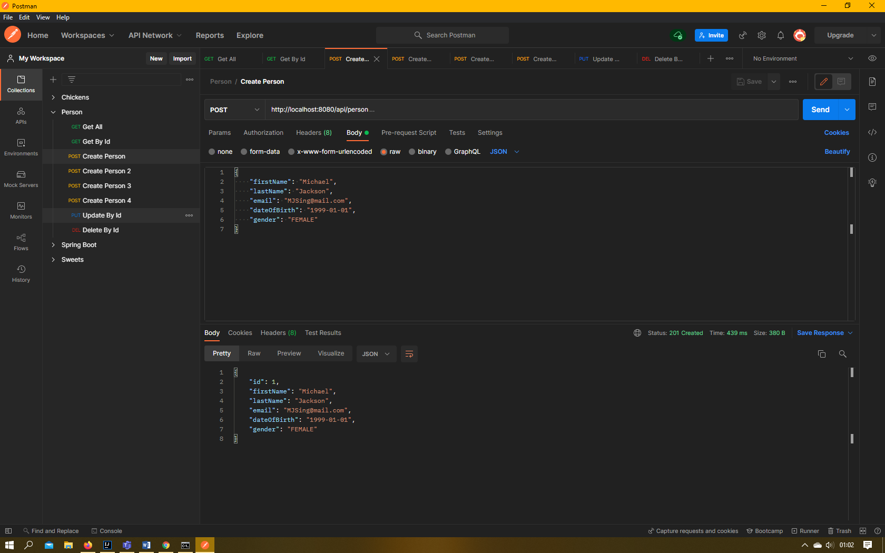
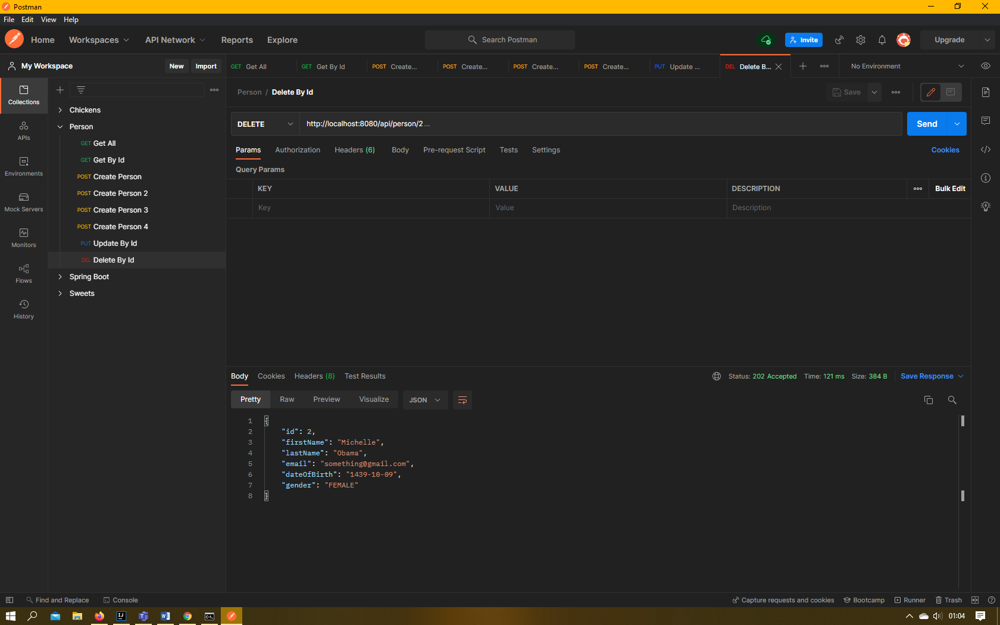
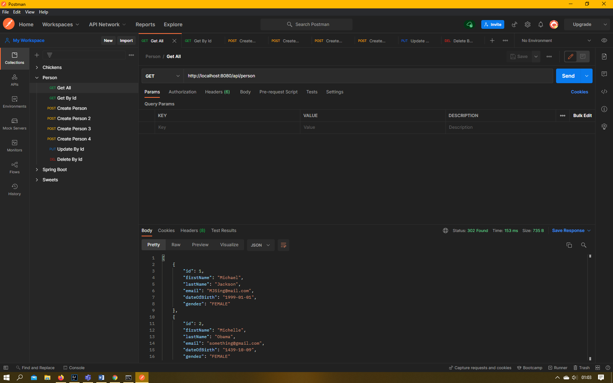
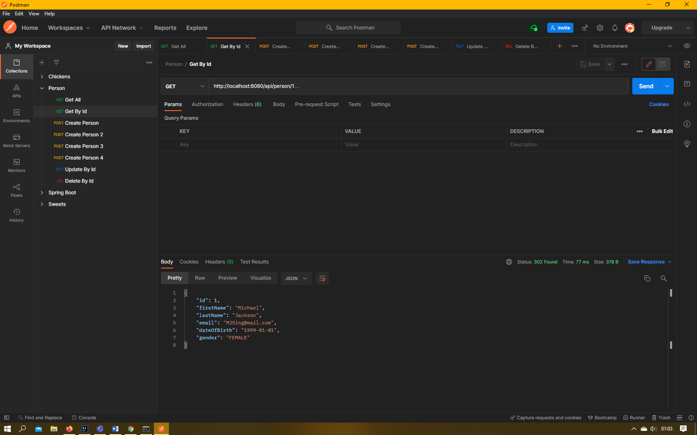
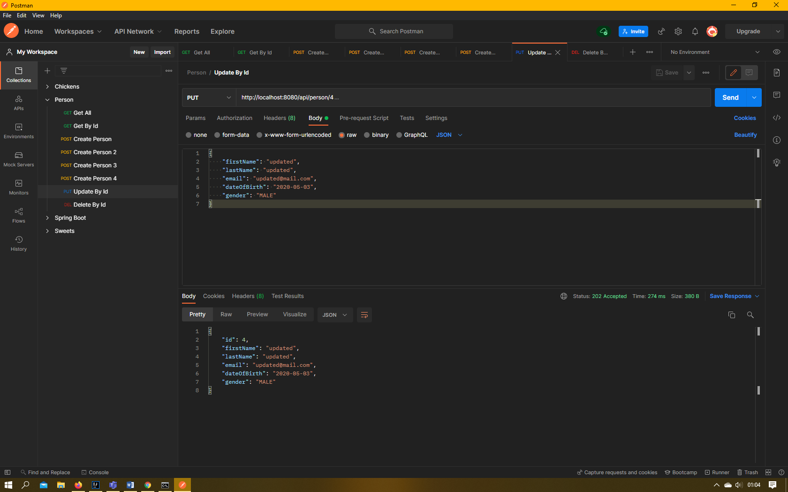
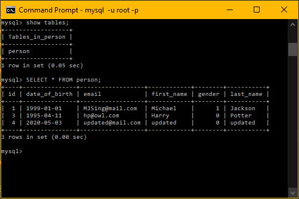
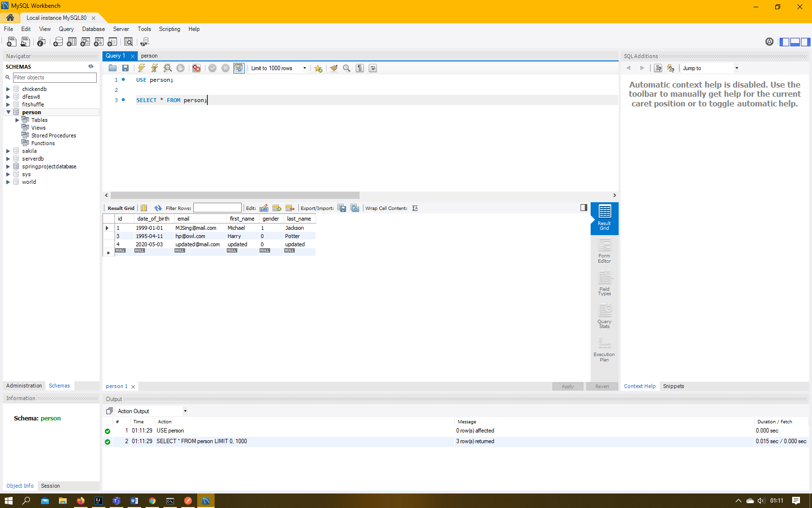
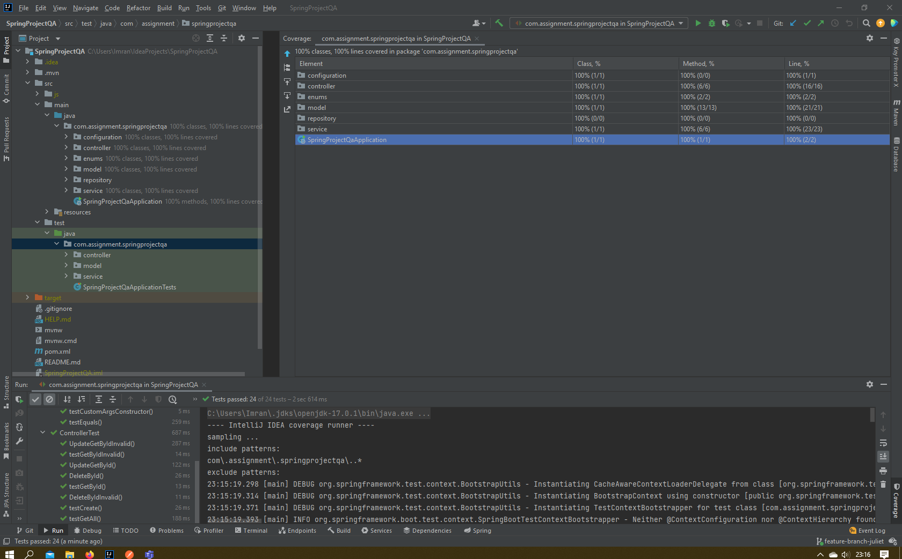

Imran Uddin QA Assignment

Why are we doing this?

- We are tasked with creating an api. This project allows us to demonstrate our technical ability and also our project management skills.

How I expected the challenge to go.

- Easy, straightforward...

What went well? / What didn't go as planned?

- Documentation was very dry... Coding was super easy.

Possible improvements for future revisions of the project.

- Relational Databases...

Screenshots showing your postman requests and the output from the API.

Screenshots of your database to prove that data is being persisted.

Screenshot of your test results, including coverage report.

Link to Jira Board 
- https://imranqajira.atlassian.net/jira/software/projects/PER/boards/4/roadmap?shared=&atlOrigin=eyJpIjoiNDNjNDM1MjYwYzM1NDY5MDliMGIxMTM5MWNkYzg3MjMiLCJwIjoiaiJ9

