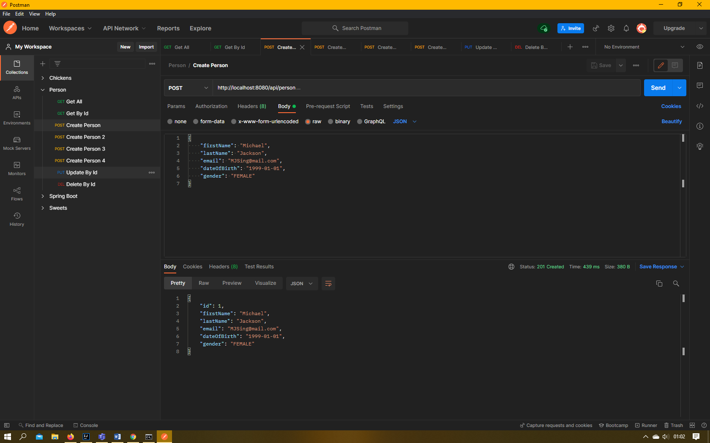
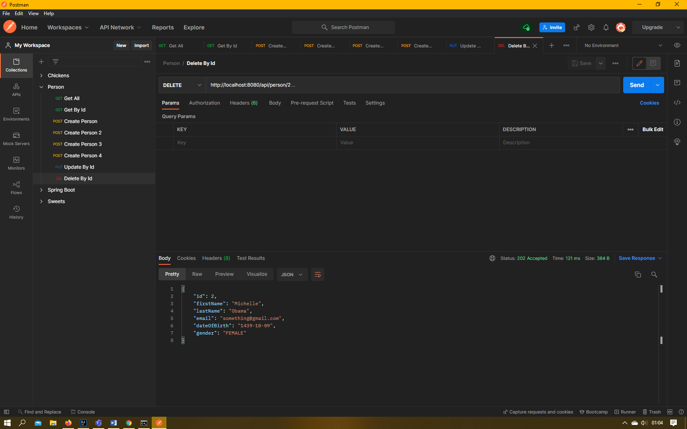
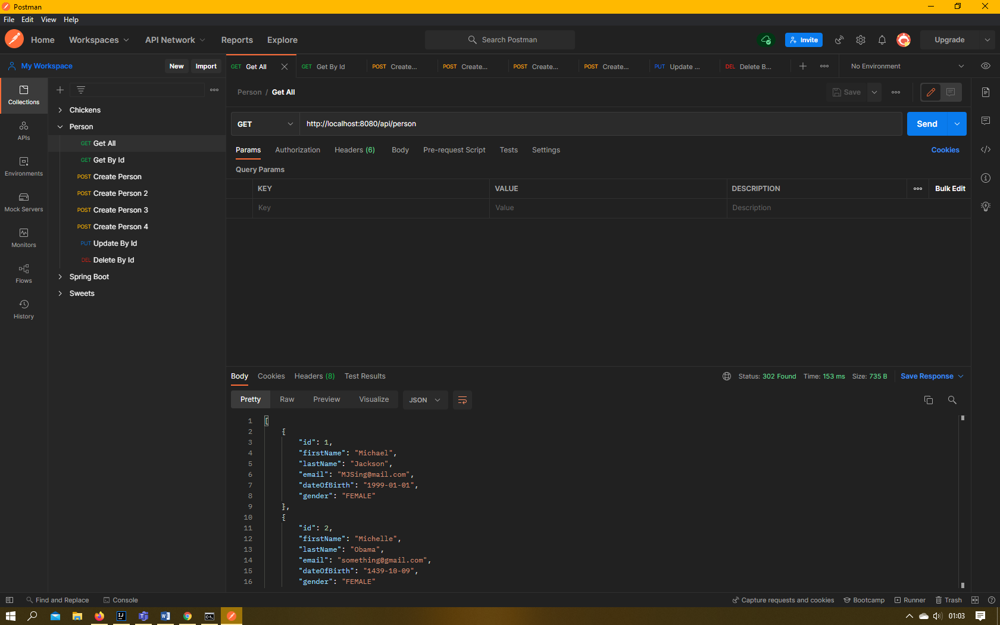
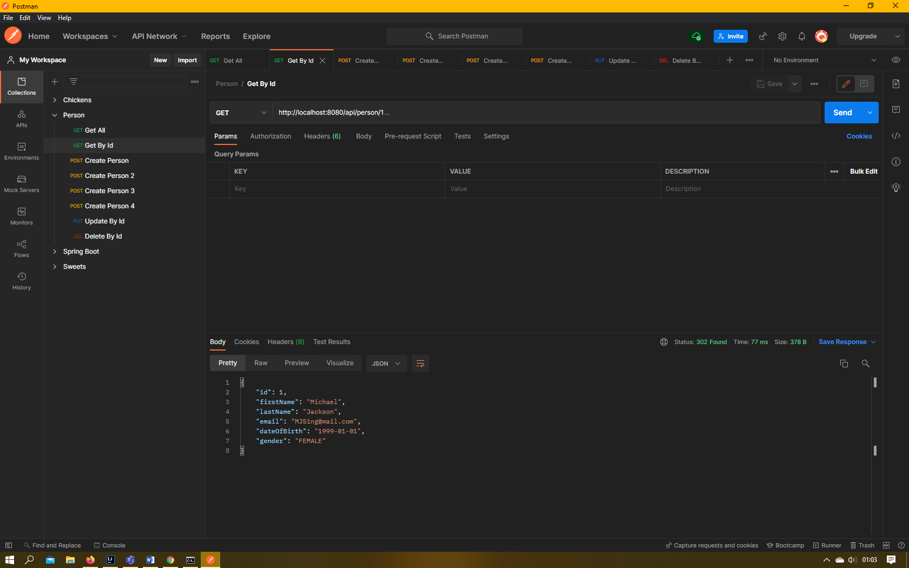
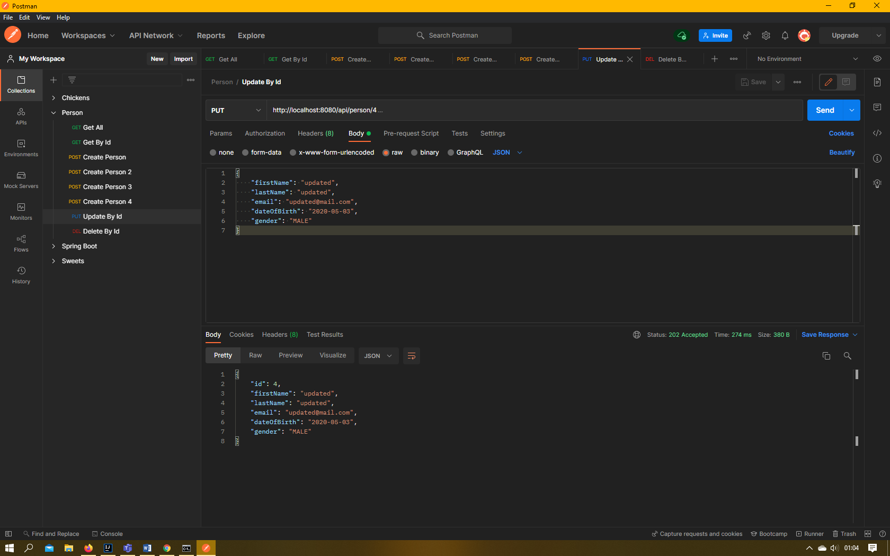
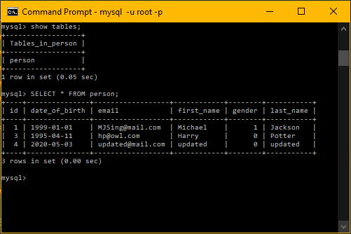
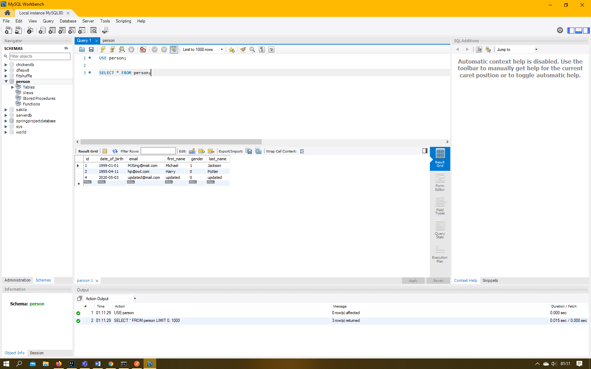
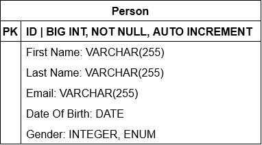

#Imran Uddin QA Assignment

Why are we doing this?

- We are tasked with creating an api. This project allows us to demonstrate our technical ability and also our project management skills.

How I expected the challenge to go.

- Easy, straightforward...

What went well? / What didn't go as planned?

- Documentation was very dry... Coding was super easy.

Possible improvements for future revisions of the project.

- Relational Databases...

Screenshots showing your postman requests and the output from the API.
- Postman Create

- Postman Delete

- Postman Get

- Postman Get by ID

- Postman Update

Screenshots of your database to prove that data is being persisted.
- Mysql Terminal

- Mysql Workbench

Screenshot of your test results, including coverage report.
- 100% Coverage

ERD Diagram
- Person Class

Link to Jira Board 
- https://imranqajira.atlassian.net/jira/software/projects/PER/boards/4/roadmap?shared=&atlOrigin=eyJpIjoiNDNjNDM1MjYwYzM1NDY5MDliMGIxMTM5MWNkYzg3MjMiLCJwIjoiaiJ9

